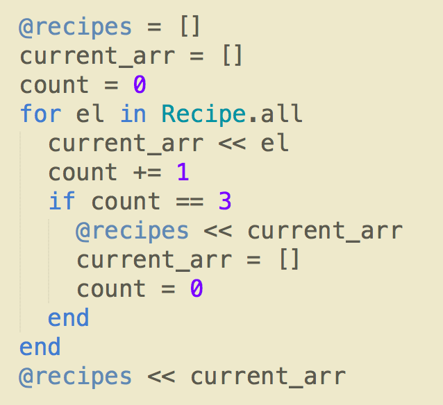

# Recipe Part Picker

Recipe Part Picker was inspired by www.pcpartpicker.com and simplifies the process of creating a grocery shopping list. Users can browse through a list of recipes created by professional chefs and add their ingredients to an easy to manage shopping list. Future plans include integration with online grocery delivery services to completely streamline the process of choosing meals, creating a shopping list from those meals, and ordering the ingredients on your shopping list. 

## Tech Stack
Recipe Part Picker was built in Ruby on Rails v5.0 and uses the following technologies:
<ul>
	<li>jQuery</li>
	<li>Sass</li>
	<li>Materialize</li>
	<li>BCrypt</li>
</ul>

## ERD

#### There was also another planned relationship for users to have a recipe list of their own curation so that they could have a custom list of recipes to add to their cart, but it was scrapped due to time constraints. 

## Wireframes

## Technical Challenges

#### Embracing Logic in the view

Materialize is not a big fan of having too many columns in one row, so to work around this I had to pass the list of recipes and ingredients as an array of arrays of length three to the view, and then set up a loop within a loop in the view logic using ERB tags (Clownhats and Sprinkles). 

 
Here we see the controller logic that constructs the array of arrays of recipes

  and here we see the double looping logic in the view

I believe I may have gone too far in embracing logic in the view with my shopping cart show page. Here you can see all the logic for formatting prices and calculating total cart price.

# Contributing
<ol>
	<li>
		Fork this repo
	</li>
	<li>
		create a new feature branch
	</li>
	<li>
		commit changes to new feature branch
	</li>
	<li>
		submit pull request
	</li>
</ol>
### Deploying
<ul>
	<li> bundle install</li>
	<li> rake db:setup</li>
</ul>

